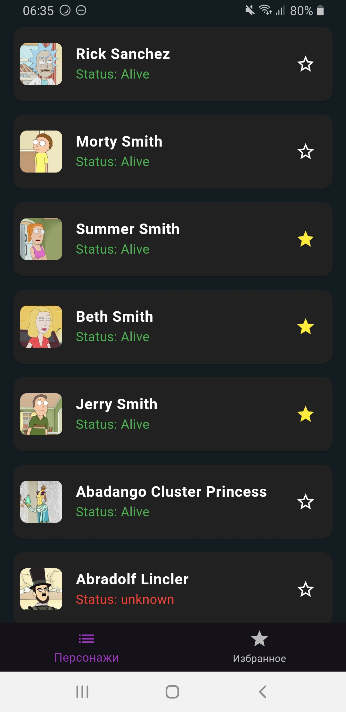
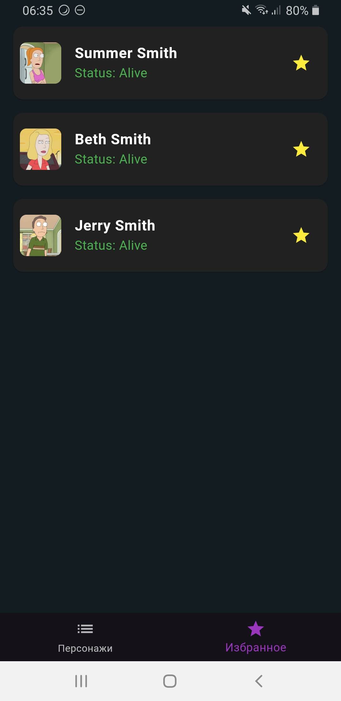

# Проект "Список персонажей"

Этот проект представляет собой приложение для отображения списка персонажей с возможностью добавления в избранное.

## Функциональные требования ✅

1.  **Главный экран (Список персонажей)** ✅
    * Отображает список персонажей в виде карточек. ✅
    * Карточка персонажа содержит:
        * Изображение персонажа. ✅
        * Имя персонажа. ✅
        * Дополнительные характеристики (на выбор разработчика, например, статус, вид, локация и т. д.). ✅
        * Кнопка "звездочка" (IconButton) для добавления в избранное (заполненная — в избранном, пустая — не в избранном). ✅
2.  **Экран "Избранное"** ✅
    * Отображает список избранных персонажей. ✅
    * Такие же карточки, как на главном экране. ✅
    * Сортировка (по имени, по статусу или по другому параметру – на выбор разработчика). ❌
    * Возможность удаления персонажа из избранного. ✅
3.  **Навигация** ✅
    * Навбар (BottomNavigationBar) для переключения между экранами. ✅
4.  **Дополнительно** ✅
    * Пагинация: подгрузка новых персонажей на главном экране при скролле. ❌
    * Кеширование: загруженные данные должны сохраняться локально, чтобы приложение работало без интернета. 🟡 (кроме картинок)
    * Фавориты должны сохраняться в базе данных (например, SQLite, Drift, Hive, Isar, SharedPreferences). ✅

## Нефункциональные требования ️

* Использовать любой state management (ChangeNotifier/bloc/StateNotifier/MobX/Redux/StateNotifier/GetX) ️✅
* Минимальный набор зависимостей (бд и работа с сетью) ️✅
* API-запросы можно делать через REST или GraphQL (на выбор). ️✅
* Код должен быть чистым, читаемым и структурированным. ️✅

## Будет плюсом ✨

* Поддержка темной темы с возможностью переключить ✨❌
* Кастомные анимации при добавлении/удалении избранных ✨❌

   
  
 
  

